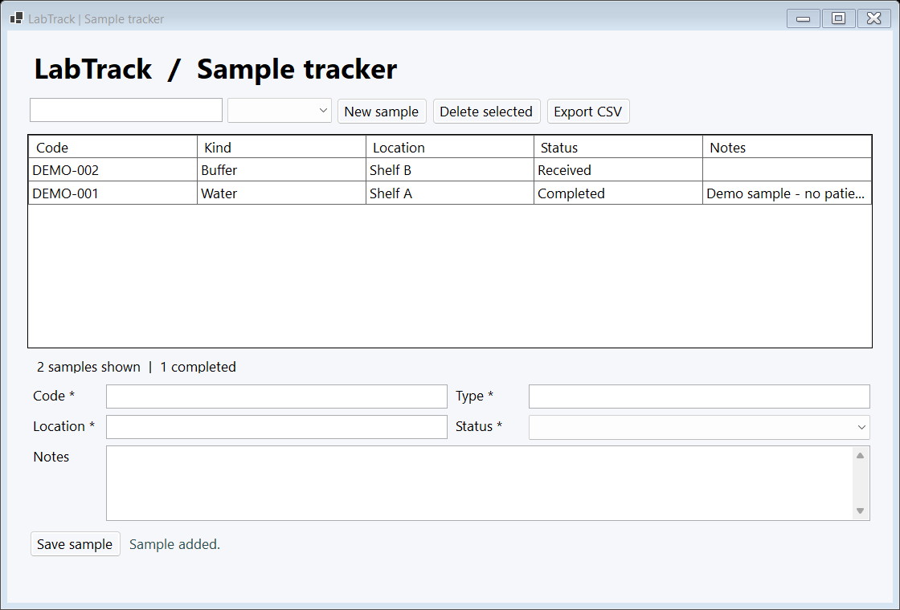

# LabTrack

A beginner-friendly C# / .NET 8 Windows Forms desktop application for tracking demo lab samples. Created as an **AI-assisted personal learning project**: a small, inspectable example of event handlers, classes, validation, SQL persistence, automated tests and Windows deployment.

## What works

- Add, edit and delete samples (unique code, type, location, status, notes).
- Search code/type/location and filter Received / In progress / Completed.
- Required-field and length validation, case-insensitive duplicate prevention, deletion confirmation.
- SQLite persistence between launches, using parameterized queries.
- Export the filtered list to CSV, including quoted fields and spreadsheet-formula protection.
- Self-contained Windows x64 release: no separate .NET installation needed.



## Run the release

Download `LabTrack-win-x64.zip` from this repository's Releases, extract it, and double-click `LabTrack.exe` on Windows 10/11 x64. The executable is unsigned. Data lives at `%LOCALAPPDATA%\LabTrack\samples.db`, independently of the extracted app folder. Close the app before copying that database for a backup. The app has no account or network requirement.

Try: New sample → enter `DEMO-001`, `Water`, `Shelf A` → Save sample → select its row → change status → Save sample → filter → Export CSV. Delete selected asks for confirmation. Export includes the current filters; New sample clears the editor, not the database.

## Run from source

Install the .NET 8 SDK or newer on Windows, then run from the repository root:

```powershell
dotnet run --project src/LabTrack.App
dotnet test tests/LabTrack.Tests -c Release
./scripts/publish.ps1
```

The packaging script runs tests and produces `artifacts/LabTrack-win-x64.zip`. CI repeats these steps on Windows.

## Understand the code

1. `src/LabTrack.Core/SampleStore.cs`: the Sample record, validation rules, database CRUD and CSV serialization. Read `Save` first; every SQL value is a parameter.
2. `src/LabTrack.App/MainForm.cs`: controls, layouts and event handlers. Follow Save button → `SaveSample` → repository → `RefreshGrid`.
3. `src/LabTrack.App/Program.cs`: startup, per-user data folder, error logging and an isolated UI smoke-test mode.
4. `tests/LabTrack.Tests/StoreTests.cs`: persistence, rejected input, duplicates, filtering, escaping and failure-path tests using temporary databases.
5. `scripts/publish.ps1`: build a distributable app with the runtime included.

No ORM, server, dependency-injection framework, login system or cloud service is required. The UI is built in C# to make layout and event wiring visible in one file.

## Scope and AI use

This is a local, single-user educational sample for **synthetic data**, not a clinical or production laboratory information system. It has no audit trail, role-based access, regulatory validation, synchronization or AI inference feature. AI assistance was used to scaffold, explain and test the implementation; the separate V-Feng project demonstrates AI application integration. Review and run this project yourself before presenting it as a skill you can explain in an interview.

Suggested learning exercises: add a received-date field with migration, add a test for it, then add a new status filter. See [the walkthrough](docs/LEARNING.md) and [verification notes](docs/QUALITY.md).

## References

- [Microsoft .NET publishing](https://learn.microsoft.com/en-us/dotnet/core/deploying/)
- [Microsoft SQLite parameters](https://learn.microsoft.com/en-us/dotnet/standard/data/sqlite/parameters)
- [Windows Forms overview](https://learn.microsoft.com/en-us/dotnet/desktop/winforms/overview/)
